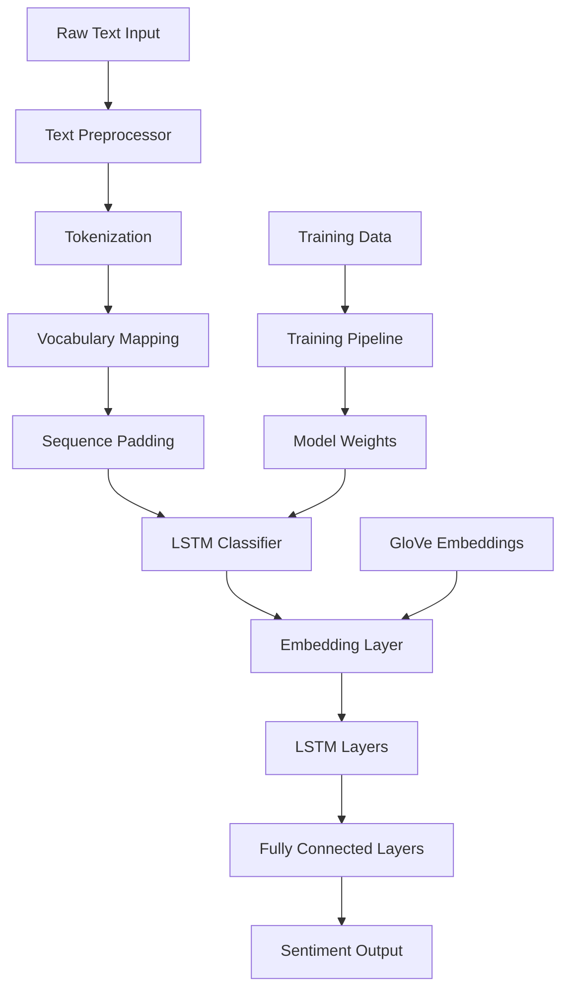

# Design Document

## Overview

The LSTM Sentiment Classifier is a deep learning system built with PyTorch that performs binary sentiment classification on movie reviews. The system uses a multi-layered neural network architecture combining embedding layers, LSTM recurrent layers, and fully connected layers to achieve high accuracy sentiment prediction.

## Architecture

The system follows a modular pipeline architecture with clear separation of concerns:



## Components and Interfaces

### 1. Text Preprocessor (`text_preprocessor.py`)

**Purpose:** Handles all text cleaning, tokenization, and numerical conversion operations.

**Key Methods:**
- `tokenize(text: str) -> List[str]`: Splits text into tokens
- `build_vocabulary(texts: List[str], min_freq: int = 2) -> Dict`: Creates word-to-index mapping
- `text_to_sequence(text: str) -> torch.Tensor`: Converts text to numerical sequence
- `pad_sequences(sequences: List[torch.Tensor], max_length: int) -> torch.Tensor`: Applies padding

**Dependencies:** torchtext, re, collections

### 2. LSTM Classifier (`lstm_model.py`)

**Purpose:** Defines the neural network architecture for sentiment classification.

**Architecture Layers:**
- Embedding Layer: 300-dimensional GloVe embeddings
- LSTM Layers: 2-layer bidirectional LSTM with 128 hidden units each
- Dropout: 0.3 dropout rate for regularization
- Fully Connected: Linear layers with ReLU activation
- Output Layer: Single sigmoid output for binary classification

**Key Methods:**
- `__init__(vocab_size, embedding_dim, hidden_dim, output_dim, n_layers, dropout)`
- `forward(x: torch.Tensor) -> torch.Tensor`: Forward pass through network
- `init_hidden(batch_size: int) -> Tuple[torch.Tensor, torch.Tensor]`: Initialize hidden states

### 3. Training Pipeline (`train.py`)

**Purpose:** Orchestrates the complete model training workflow.

**Key Components:**
- Data loading and preprocessing
- Model initialization with GloVe embeddings
- Training loop with backpropagation
- Validation and early stopping
- Model checkpointing

**Key Methods:**
- `load_imdb_data() -> Tuple[Dataset, Dataset]`: Loads and splits IMDB dataset
- `train_epoch(model, dataloader, optimizer, criterion) -> float`: Single training epoch
- `evaluate_model(model, dataloader, criterion) -> Tuple[float, float]`: Model evaluation
- `save_checkpoint(model, optimizer, epoch, loss, path)`: Save model state

### 4. Inference Engine (`inference.py`)

**Purpose:** Provides interface for making predictions on new text inputs.

**Key Methods:**
- `load_model(model_path: str) -> torch.nn.Module`: Load trained model
- `predict_sentiment(text: str) -> Tuple[str, float]`: Single text prediction
- `batch_predict(texts: List[str]) -> List[Tuple[str, float]]`: Batch predictions
- `preprocess_for_inference(text: str) -> torch.Tensor`: Prepare text for model

### 5. Model Evaluator (`evaluation.py`)

**Purpose:** Comprehensive model performance analysis and visualization.

**Key Methods:**
- `calculate_metrics(y_true, y_pred) -> Dict`: Accuracy, precision, recall, F1
- `plot_confusion_matrix(y_true, y_pred)`: Visualization of classification results
- `plot_training_history(train_losses, val_losses)`: Training progress visualization
- `generate_evaluation_report() -> Dict`: Complete performance summary

## Data Models

### Text Processing Data Flow

```python
# Input: "This movie was absolutely fantastic!"
# Tokenized: ["this", "movie", "was", "absolutely", "fantastic", "!"]
# Indexed: [45, 123, 67, 892, 234, 12]
# Padded: [45, 123, 67, 892, 234, 12, 0, 0, 0, 0]  # padded to max_length
# Tensor: torch.tensor([[45, 123, 67, 892, 234, 12, 0, 0, 0, 0]])
```

### Model Architecture Specifications

```python
class LSTMClassifier(nn.Module):
    def __init__(self, vocab_size=10000, embedding_dim=300, hidden_dim=128, 
                 output_dim=1, n_layers=2, dropout=0.3):
        # Embedding: vocab_size x embedding_dim (10000 x 300)
        # LSTM: bidirectional, hidden_dim=128, n_layers=2
        # FC1: (hidden_dim * 2) x 64 (256 x 64)
        # FC2: 64 x output_dim (64 x 1)
```

### Training Configuration

```python
HYPERPARAMETERS = {
    'batch_size': 64,
    'learning_rate': 0.001,
    'epochs': 20,
    'max_sequence_length': 500,
    'embedding_dim': 300,
    'hidden_dim': 128,
    'n_layers': 2,
    'dropout': 0.3,
    'optimizer': 'Adam',
    'loss_function': 'BCEWithLogitsLoss'
}
```

## Error Handling

### Input Validation
- Empty text inputs return appropriate error messages
- Out-of-vocabulary tokens mapped to UNK token
- Sequence length validation and truncation for overly long inputs
- Model file existence checks before loading

### Training Robustness
- Gradient clipping to prevent exploding gradients
- Early stopping based on validation loss plateau
- Automatic model checkpointing to prevent loss of progress
- Memory management for large datasets

### Inference Safety
- Model state validation before predictions
- Batch size limitations to prevent memory overflow
- Graceful handling of preprocessing failures
- Confidence score thresholding for uncertain predictions

## Testing Strategy

### Unit Testing Focus Areas
- Text preprocessing functions (tokenization, vocabulary building, padding)
- Model architecture initialization and forward pass
- Training utilities (loss calculation, metric computation)
- Inference pipeline (single and batch predictions)

### Integration Testing
- End-to-end training pipeline with sample data
- Model saving and loading functionality
- Complete inference workflow from raw text to prediction
- Performance evaluation pipeline

### Performance Testing
- Training time benchmarks on different dataset sizes
- Inference speed measurements for single and batch predictions
- Memory usage profiling during training and inference
- Accuracy validation against known benchmarks

### Data Quality Testing
- Preprocessing consistency across training and inference
- Vocabulary coverage analysis
- Embedding initialization verification
- Model convergence validation on synthetic data